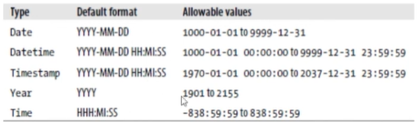

## Introdução ao SQL
- **Conceito**:  
  SQL (Structured Query Language) é a linguagem padrão para interação com bancos de dados relacionais.  
  Permite manipular dados por meio de comandos e executar operações lógicas e estruturais sobre o banco.

- Linguagem declarativa e autoexplicativa:  
  Você informa *o que* deseja obter ou modificar, e o SGBD decide *como* executar.

- **Objetivo**:  
  - Modificação de dados e da estrutura do banco.  
  - Executar operações de **CRUD**:
    - **Create** – Inserir dados  
    - **Read** – Consultar dados  
    - **Update** – Atualizar dados  
    - **Delete** – Remover dados  
  - Recuperar subconjuntos de informações específicas do banco de dados.

- Organização em subgrupos (Sublinguagens).

> Sublinguagens do SQL

O SQL é dividido em categorias conforme o tipo de operação executada.

### DDL – Data Definition Language
Responsável pela **definição e modificação da estrutura** do banco de dados.

Principais comandos:
- `CREATE` – Criar objetos (tabelas, bancos, índices)
- `DROP` – Remover objetos
- `ALTER` – Alterar estrutura
- `RENAME` – Renomear objetos
- `TRUNCATE` – Remover todos os registros de uma tabela
- `MERGE` – Mesclar dados entre tabelas (dependendo do SGBD)

> Observação: `INSERT`, `UPDATE` e `DELETE` pertencem à DML (Data Manipulation Language), pois manipulam dados, não estrutura. Apesar disso, eles usam estes comando quandi vão buscar dados. 

- Controle de Acesso e Organização
O SQL também permite:

- Definir quais usuários terão acesso ao banco  
- Conceder e revogar privilégios  
- Criar e organizar esquemas  
- Criar índices para otimização de consultas  
- Executar statements administrativos

- Exemplo:
```sql
CREATE TABLE employee (
    id INT AUTO_INCREMENT PRIMARY KEY,
    
    first_name VARCHAR(50) NOT NULL,
    last_name VARCHAR(50) NOT NULL,
    
    email VARCHAR(100) UNIQUE,
    
    birth_date DATE,
    
    salary DECIMAL(10,2) NOT NULL CHECK (salary >= 0),
    
    gender ENUM('M','F','O') NOT NULL,
    
    status ENUM('Ativo','Inativo','Afastado') DEFAULT 'Ativo',
    
    hire_date DATETIME DEFAULT CURRENT_TIMESTAMP,
    
    department_id INT,
    
    CONSTRAINT fk_employee_department
        FOREIGN KEY (department_id)
        REFERENCES department(id)
);
```


> DML – Data Manipulation Language

**Conceito:**  
Responsável pela manipulação dos dados dentro das tabelas.  
Não altera a estrutura, apenas os registros.

**Principais comandos:**

- `INSERT` → Inserir registros  
- `UPDATE` → Atualizar registros  
- `DELETE` → Remover registros  
- `MERGE` → Mesclar dados (combina INSERT e UPDATE, depende do SGBD)

> DCL – Data Control Language

**Conceito:**  
Controla permissões e segurança do banco de dados.

**Principais comandos:**

- `GRANT` → Conceder privilégios  
- `REVOKE` → Revogar privilégios  

Usado para definir quem pode acessar, modificar ou consultar dados.

> DQL – Data Query Language

**Conceito:**  
Responsável pela consulta e recuperação de dados.

**Principal comando:**

- `SELECT` → Consultar dados  

Permite:
- Filtrar (`WHERE`)
- Ordenar (`ORDER BY`)
- Agrupar (`GROUP BY`)
- Usar funções de agregação (`COUNT`, `SUM`, `AVG`, etc.)
- Fazer junções (`JOIN`)

> Statement: 
- Estado do banco de dados, comando/intrução, reconhecidos pelo BD, retorna ao registro de dados.
- As cláusulas são funções que definem as instruções (statements). As instruções por sua vez retornar os registros do banco de dados.
> Cláusulas SQL
- Função -> Intrução 
- Algumas são obrigatorias.
- ``SELECT * FROM table1``: Obrigatório.
- ``SELECT now()``

- Tipos:
- SELECT, FROM, WHERE.
- ORDER BY, GRUOP BY, HAVING.

> Termos SQL
- Identificador → Nome de objeto.
- Operador → Executa ação.
- Constante → Valor fixo.
- Expressão → Combinação que gera resultado.

> Tipos de dados no MySQL

- Os tipos de dados definem **qual tipo de valor** uma coluna pode armazenar.
- Fixo e Varpiavel.

- Tipos Numéricos
Usados para números inteiros ou decimais.

-  Inteiros
- `TINYINT` → inteiro pequeno  
- `SMALLINT` → inteiro médio-pequeno  
- `INT` → inteiro padrão  
- `BIGINT` → inteiro grande  

Podem usar `UNSIGNED` (somente positivos).

- Decimais
- `DECIMAL(p,s)` → números exatos (ex: dinheiro)
- `FLOAT` / `DOUBLE` → números com ponto flutuante (aproximados)

- Tipos de Texto (String)
Usados para armazenar caracteres.

- `CHAR(n)` → tamanho fixo  
- `VARCHAR(n)` → tamanho variável  
- `TEXT` → textos grandes  

- Tipos de Data e Hora
Armazenam valores temporais.

- `DATE` → data (AAAA-MM-DD)  
- `TIME` → hora  
- `DATETIME` → data + hora  
- `TIMESTAMP` → data/hora com controle automático  
- `YEAR` → ano  

---


---
- ENUM e SET
- `ENUM` → lista fixa de valores permitidos  
  Ex: `ENUM('M','F')`
- `SET` → permite múltiplos valores pré-definidos

- Tipos Booleanos
- `BOOLEAN` → verdadeiro ou falso  
  (Internamente é `TINYINT(1)`)

- 6. Tipos Binários
- `BLOB` → dados binários grandes (imagens, arquivos)  
- `VARBINARY` → binário variável  

> Constraint (Restrições):
- NOT NULL
- PK e FK

- DEFAULT: Valor padrão.
- CHECK: Se o valor inserido corresponde.

- DELETE: Remover uma instância da tabela.

- PRIMARY KEY
- UNIQUE

- TRIGER interno no banco de dados para UNIQUE e PRIMARY KEY

> Queries/Insertion com SQL
- Comportamento 
- Multiset - not set.
- Duplicações (Redundâncias)

- Previnir-los com constraints.

- ALL: Todos
- DISTINCT: Primeira ocorrência.

- Mapping com select com "*"
- Inserindo.


> Nomes, Aliasing e Variação de Tuplas – SQL

- Nome:
- Quando duas tabelas possuem colunas com o mesmo nome, você precisa especificar de qual tabela vem o campo.
- Alias serve para: Encurtar nomes de tabelas. Melhorar leitura. Renomear colunas no resultado
- Alias para tabela
``` sql
-- Alias para tabela
SELECT e.ssn, d.department_name
FROM employee e
INNER JOIN department d
ON e.ssn = d.manager_ssn;

-- e e d são apelidos.

-- Alias para coluna 
SELECT 
    e.first_name AS Nome,
    e.salary AS Salario
FROM employee e;


```
- AS é opcional. Tem como renomear todos os atributos de um única tabela de uma vez.

```sql
-- Variação de Tuplas
-- Tupla = linha (registro).
-- Você pode gerar variações usando:

-- Condições
SELECT *
FROM employee
WHERE salary > 3000;

-- Junções (combinação de tuplas)
SELECT e.first_name, d.department_name
FROM employee e
INNER JOIN department d
ON e.department_id = d.department_id;
```


> When Good Statements Go Bad
- Erros comuns: PK inesistente. FK inesistente. Violação de valores.

#### SQL x POSTGREE
- **SQL**: Agilidade e versatilidade. Operações mais simples. Processamento e tempo curto em resposta. Ex: Site.
- **POSTGREE**: Otimizado para aplicações complexas. Grande volume de dados. Ex: E-commerce. 

Ponderações: MySQL não consegue desfazer ações. 


