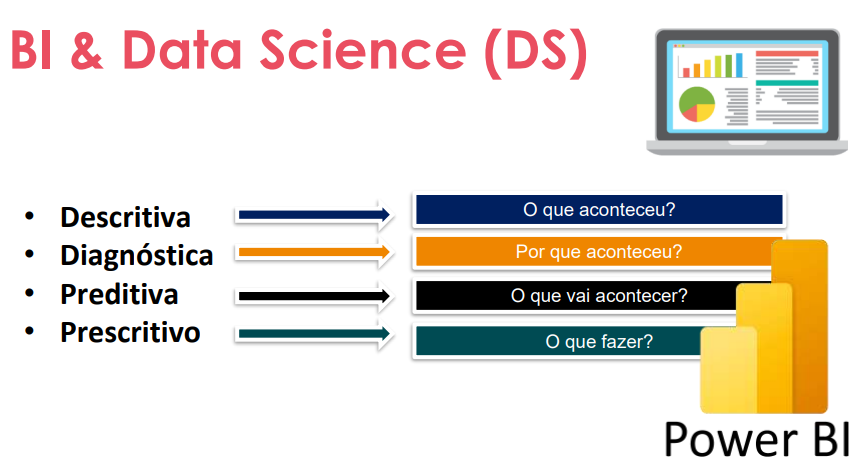

## O que é o Power BI?
O Power BI é uma plataforma de business intelligence desenvolvida pela Microsoft que permite a criação de relatórios e dashboards interativos para análise de dados. Ele é amplamente utilizado por empresas para transformar dados brutos em insights visuais, facilitando a tomada de decisões informadas. O Power BI oferece uma variedade de ferramentas para conectar-se a diferentes fontes de dados, realizar transformações e criar visualizações personalizadas.

---

---

> Preenche a luna entre os dados e a tomada de decisão.
- Análise descritivas. Dashboards. Relatórios.
- Qualidade dos dados. 

> Recursos:
- Power Bi. Power Automate. Power APPs. Power Gateway. 

> Exportação pelo git hub + readme

#### Conhecendo o Power BI Desktop
- Guias: Relatório, Exibição de Tabela (Dados) e Modelo (Relacionamentos entre Tabelas).
- Opção **Obter Dados**: Para extrair dados de diversas fontes.
- Opção **Transformar Dados**: Para realizar a transformação e tratamento dos dados utilizando o Power Query.
- Opção **Modelo**: Para criar relacionamentos entre tabelas e definir chaves primárias e estrangeiras.
- Opção **Fórmulas DAX**: Para criar cálculos avançados e análises personalizadas nos dados.
- Opção **Relatório**: Para organizar e apresentar os dados por meio de gráficos, tabelas, mapas e outros elementos visuais.

> Pagina Inicial: Obter dados.
> Inserir: Varia. 

#### Data sets
- Conjunto de dados: Coleção de dados relacionados que são usados para análise e visualização no Power BI. Os conjuntos de dados podem ser importados de diversas fontes, como bancos de dados, arquivos Excel, serviços online, entre outros. Eles contêm as tabelas e os campos necessários para criar relatórios e dashboards interativos.

- Site: https://www.kaggle.com/datasets/kaushiksuresh147/xbox-game-pass-subscription-analysis