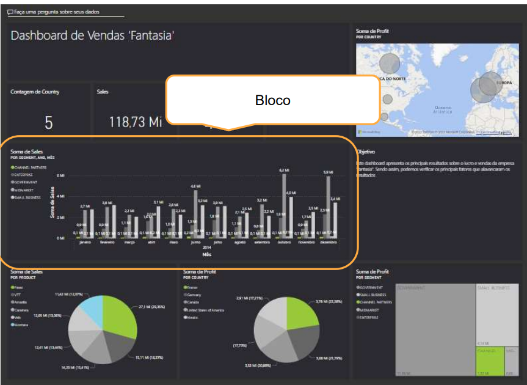

## Criando Dashboard Interativos com Power BI
> Objestivos:
- Definir um modo de exibição mobile.
- Adicionar um tema aos visuais no seu dashboard. 
- Configurar a classificação de dados.
- Adicionar em tempo real visuais de conjunto de dados aos seus dashboards. 

> O que são dashboards?
- Os dashboards permitem que os consumidores de relatório criem um artefato de dados direcionados que é personalizado apenas para eles.

Características: Visuais Fixados. Visuais de reletórios distintos. 

- Diferença entre relatórios e dashboards: Relatórios são mais detalhados, enquanto os dashboards são mais resumidos e focados em KPIs. Relatórios podem ter várias páginas, enquanto os dashboards geralmente têm uma única página. Relatórios são usados para análise de dados, enquanto os dashboards são usados para monitoramento de desempenho.

- Um vitrine. 

- Vários conjunto de dados ou reports
- Não possuem painéis Filtro, Visualizaçaõ e Campos
- Podem ter apenas uma página
- Dataset analisado -> report
- Ambos podem ser atualizados
- **Maipulação dos blocos / Dividido em blocos.** 

---

---

> Alertas em dashboards:
- Notificação de usuário. Presentes em elementos: Mediações, cartões e KPIs.

> Quando usar Dashboards?
- "Os dashboards devem ser uma coleção de várias fontes, não apenas uma "plataforma de lançamento" para relatórios."

> Streaming no Power BI

- Capacidade de exibir dados em tempo real
- Grande volume e velocidade
- Dashboards são telas de histórias
- Dados em cache temporário

- Uso de API