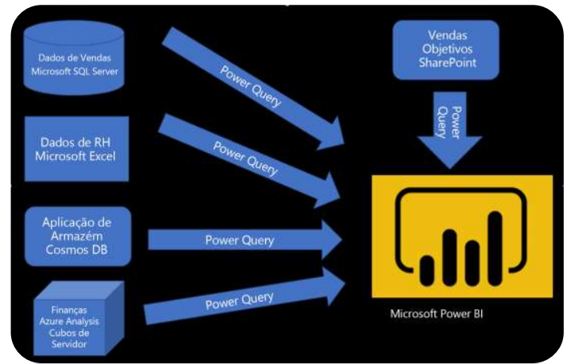

## Coleta e Extração de Dados com Power BI
> Objetivo Geral:

- Identificar e ligar a uma origem de dados
- Obter dados de uma base de dados de diferentes fontes
- Obter dados do Azure Analysis Services
- Selecionar um modo de armazenamento
- Corrigir problemas de desempenho
- Resolver erros de importação de dados

> Coletando de fontes distintas com Power BI:
- Integração do Power Bi com outros Sistemas.
---

---
**Power Query**: é uma ferramenta de transformação de dados que permite aos usuários importar, limpar e transformar dados de várias fontes antes de carregá-los no Power BI para análise. Ele oferece uma interface intuitiva para realizar operações como filtragem, mesclagem, divisão e agregação de dados, facilitando a preparação dos dados para visualização e análise no Power BI.

> Power Query
Organização dos Dados
- Manipular dados
- Remover erros
- Combinar resultados

> Fluxo de Dados no Power BI
---

---
- Coleta e Transformação.

> Ficheiros
- csv
- txt
- excel

> De onde vem?
- Local
- Onedrive (pessoal ou empresa)
- Sharepoint
- Banco de Dados
- Sistemas, APIs, ….

> Dataset de origem
- Mudança durante projeto
- Atualização do local do datase

- SQL DATABASE -> POWER BI -> Dashboard.

- Criteriosidade da estrutura que a base de dados possui.

#### Conexão com MYsql
- Conectar o Power BI a um banco de dados MySQL é um processo relativamente simples. Aqui estão os passos básicos para estabelecer essa conexão:
1. **Instalar o Conector MySQL**: Certifique-se de que o conector MySQL para Power BI esteja instalado em seu computador. Você pode baixar o conector do site oficial da MySQL.
2. **Abrir o Power BI**: Inicie o Power BI Desktop em seu computador.
3. **Obter Dados**: Na tela inicial do Power BI, clique em "Obter Dados" ou "Get Data" para abrir a janela de seleção de fontes de dados.
4. **Selecionar MySQL**: Na janela de seleção de fontes de dados, procure por "MySQL" e selecione a opção correspondente.
5. **Configurar Conexão**:
   - **Servidor**: Insira o nome do servidor onde o banco de dados MySQL está hospedado. Isso pode ser um endereço IP ou um nome de domínio.
   - **Banco de Dados**: Insira o nome do banco de dados ao qual deseja se conectar.
   - **Autenticação**: Escolha o método de autenticação (geralmente "Autenticação do SQL Server" ou "Autenticação do Windows") e forneça as credenciais necessárias (nome de usuário e senha).
6. **Testar Conexão**: Clique no botão "Testar Conexão" para verificar se as informações fornecidas estão corretas e se a conexão pode ser estabelecida com sucesso.
7. **Importar Dados**: Se a conexão for bem-sucedida, você poderá escolher as tabelas ou consultas que deseja importar para o Power BI. Selecione as tabelas desejadas e clique em "Carregar" para importar os dados para o Power BI.

> Quando utilizar o SQL para Importar Dados de um Banco de Dados ?
- Seleção de dados da base
- Carregamento parcial
- Junção de tabelas

> Conexão NOSQL
- Document model
- JSON
- SQL Flavor

> Armazenamento de dados: Facilidade x disponibilidade
- Acesso aos dados
- Tempo de carregamento
- Permissão de acesso

• Importar
• DirectQuery
• Composto

- OBS: Direct Query é um modo de conexão do Power BI que não importa ou armazena dados no arquivo, consultando a fonte (como SQL ou Oracle) em tempo real a cada interação.

#### Lidando com Problemas de Desempenho no Power BI
- Um deles é a Lentidão no carregamento.

- **Dobragem de Consultas**. Necessita de: Aumento de desempenho. Transformações controladas pela tool. Execução no servidor (SQL).

"O motivo para a implementação deste processo é garantir que
estas transformações possam acontecer no servidor de origem de
dados original sem sobrecarregar os recursos de computação do
Power BI."

- Mais eficiência em atualizações de dados
- Compatibilidade automática com modos de
armazenamento

> Performance
- Processar dados na origem
- Utilizar SQL nativo
- Separar data e a hora do mesmo campo
- Manter a base a ser utilizada

- Erros de • Importação de diversas fontes. 

