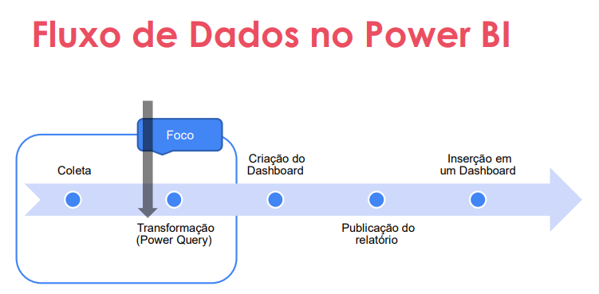
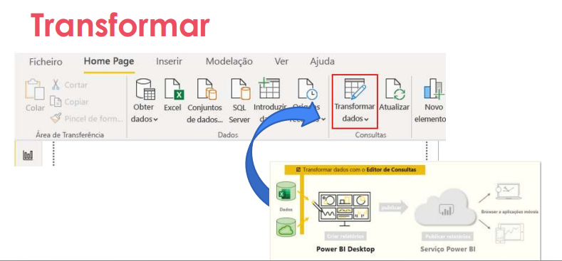

## Limpeza e Transformação de Dados com Power BI

> Objetivo Geral
- Executar processos de limpeza e transformação de dados utilzando a interface do Power BI.
- Tópicos mais avançados como DAX serão aboradados em próximos módulos.

> Termos de dados não prontos para analise:
- Status – tipo numérico 
- Erros nas colunas 
- Valores nulos 
- Duplicações de IDs 
- Coluna complexa - endereço

> Problemas
- Dados inválidos
- Resultados incorretos
- Relatórios equivocados
- Más decisões


> Dados Limpos

- Resultados precisos quando fazem agregações e cálculos.
- As tabelas são organizadas
- As duplicatas são removidas
- Divisão de uma coluna complicada em duas colunas mais simples.
- Combinação de colunas para facilitar a leitura.
- Códigos e inteiros podem ser substituídos por valores legíveis por humanos.

---


---

> Com Dados Limpos Conseguimos

- Como resolver inconsistências?
- Como substituir valores.
- Analisar dados das colunas.
- Transformar dados das colunas.
- Combinar consultas.
- Aplicar nomenclaturas.
- Entender Código M.

---


---

#### Observações do procedimento:
- Alterações feitas são salvas no historico.

> **Combinação de colunas:**
- Combinar colunas para facilitar a leitura.
- Exemplo: Combinar as colunas "Nome" e "Sobrenome" em uma única coluna chamada "Nome Completo".
- Associada ao SQL CONCATENATE. Combinação de colunas para criar uma nova coluna.

> **Mescla de consultas:**
- Mesclar consultas para criar uma nova tabela que contenha dados de ambas as tabelas.
- Exemplo: Mesclar uma tabela de "Vendas" com uma tabela de "Clientes" para obter informações completas sobre as vendas realizadas por cada cliente.
- Associada ao SQL JOIN. Por uma coluna em comum entre as tabelas.

> Coluna dinamica na fase de transformação de dados:
- Agregar informações de diferentes tabelas. 
- Caso: "um conjunto de dados que são simples, mas possuem diversas informações que podem ser agregadas com relação a dados de outra coluna da mesma tabela."


##### Liguagem M
- Linguagem de programação utilizada no Power Query para realizar transformações de dados.
- Permite criar consultas personalizadas e avançadas para manipular os dados de acordo com as necessidades do usuário.
- A linguagem M é baseada em uma sintaxe funcional e é projetada para ser fácil de aprender e usar, mesmo para aqueles que não têm experiência prévia em programação.
- Com a linguagem M, os usuários podem realizar uma ampla variedade de operações de transformação de dados, como filtragem, agrupamento, ordenação, mesclagem e muito mais, tornando o Power Query uma ferramenta poderosa para a preparação de dados no Power BI.

- Basicamente se localiza na barra de formulas.
- Ex:
```m
let
    Fonte = Excel.Workbook(File.Contents("Caminho do arquivo"), null, true),
    Tabela1_Sheet = Fonte{[Item="Tabela1",Kind="Sheet"]}[Data],
    LinhasRemovidas = Table.RemoveRows(Tabela1_Sheet,{0,1}),
    ColunasRenomeadas = Table.RenameColumns(LinhasRemovidas,{{"Column1", "Nome"}, {"Column2", "Sobrenome"}}),   
    ColunaCombinada = Table.CombineColumns(ColunasRenomeadas,{"Nome", "Sobrenome"}, Combiner.CombineTextByDelimiter(" ", QuoteStyle.None), "Nome Completo")
in
    ColunaCombinada
```
