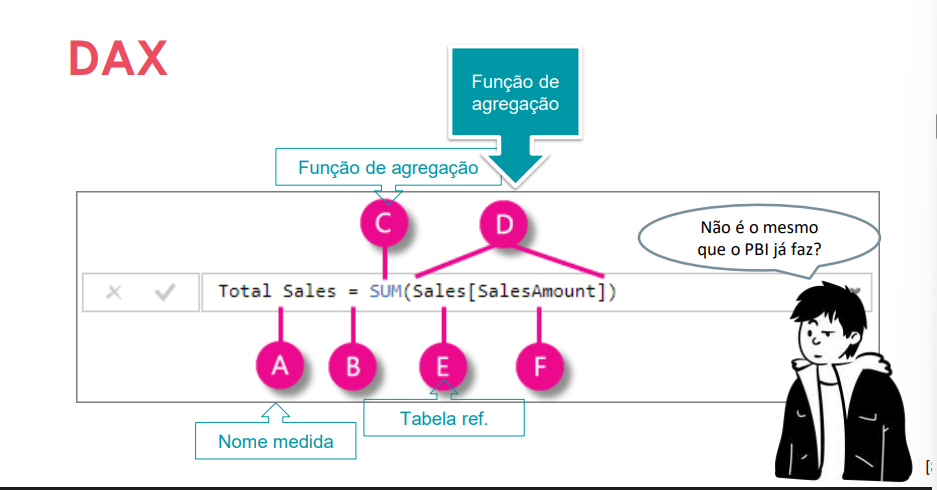
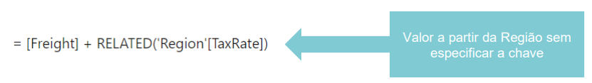
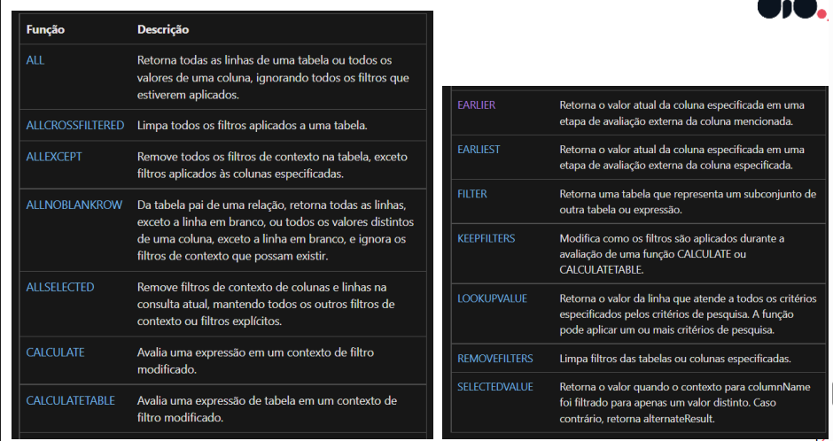

## FS com DAX e Cálculos com Power BI

> O que é DAX – Data Analysis Expressions?
DAX

- Compilar medidas rápidas.
- Criar colunas calculadas.
- Usar DAX para compilar medidas.
- Descobrir de que modo o contexto afeta as medidas DAX.
- Usar a função CALCULATE para manipular filtros.
- Implementar a inteligência de dados temporais usando o DAX.

> Colunas Calculadas
- Coluna não original
- Agregação e funções matemáticas
- DAX

> Colunas Personalizada
- Criar na origem da consulta com SQL por ex
- Power Query
- DAX na área e trabalho do Power BI


> O que é DAX ?
- O DAX é uma coleção de funções, operadores e constantes que podem ser usados em uma fórmula, ou expressão, para calcular e retornar um ou mais valores.

---


---

> Desvantagem:
- Não é bem compactada quanto os outros métodos
- Influencia no tamanho do file .pbix


> Com o DAX
- pode-se fazer mais ações de forma mais prática e fácil, do que realizar tal ato no power query.

> Use o DAX quando não houver outra alternativa

#### Função e Função X
- SUM, COUNT, MIN -> SUMX, COUNTX, MINX.
- Funções de iterator.
- Melhor desempenho e menor espaço.

#### Criando medidas rápidas no power bi
- Acessar a guia "Modelagem"
- Clicar em "Nova Medida"
- Inserir a fórmula DAX desejada
- Nomear a medida
- Pressionar Enter para confirmar
- A medida aparece na lista de campos para uso em visualizações

> Modo direto, sem criar manualmente a função DAX.


#### Medidas com DAX
- Associada a parte da programação.
- Manualmente escrita. 

-
#### Diferença entre Coluna Calculada e Medida no Power BI

| Aspecto | Coluna Calculada | Medida |
|--------|------------------|--------|
| **Quando é calculada** | No carregamento dos dados | Quando solicitado na visualização |
| **Armazenamento** | Armazenada no modelo de dados | Não armazenada (cálculo dinâmico) |
| **Contexto** | Contexto de linha | Contexto de filtro |
| **Uso** | Filtros, agrupamentos, cálculos simples | Agregações, análises, KPIs |
| **Tamanho do arquivo** | Aumenta o tamanho do .pbix | Não afeta o tamanho |
| **Performance** | Mais rápida (já calculada) | Mais lenta (calcula sob demanda) |
| **Exemplo** | Coluna de idade = 2024 - Ano Nascimento | Medida de vendas totais = SUM(Vendas) |


> Coluna Personalizada
3 formas de criar:
- Criando a coluna de origem na obtenção dos dados
- Criando com Power Query
- Criando a coluna calculada usando DAX


> No Pull dos dados

```` sql
CREATE VIEW OrdersWithTotalPrice
AS
SELECT unitprice, qty, unitprice * qty as TotalPrice
FROM sales.salesorders
````

- 
#### Passos para Criar uma Coluna Personalizada

**No Power Query:**
1. Abrir Power Query (Transformar dados)
2. Clicar em "Coluna Personalizada" na guia "Adicionar Coluna"
3. Inserir a fórmula desejada
4. Nomear a coluna
5. Clicar em "OK"

**Com DAX no Power BI:**
1. Acessar a guia "Modelagem"
2. Clicar em "Nova Coluna"
3. Inserir a fórmula DAX
4. Pressionar Enter para confirmar

**Na Origem (SQL):**
1. Criar a coluna na query SQL com CREATE VIEW ou SELECT
2. Importar os dados no Power BI


#### Medidas 
- Uteis para operar linha por linha 
- Medidas Rápidas ou/e com DAX 
- Calculadas sob demanda 

> As medidas são calculadas com base nos filtros usados pelo usuário do relatório. Esses filtros são combinados para criar o contexto do filtro.


**Colunas**: 
-  Será armazenado no arquivo .pbix 
-  Cada coluna aumenta o espaço usado 

> Aumento de espaço que possivelmente aumentará o tempo de atualização.


#### Entendendo o Contexto com DAX

> Contexto
- Contexto afeta as medidas DAX
- Mesma medida com Resultados Diferentes

> Dados afetados pelos filtros aplicados a tabelas dinâmicas, relações entre tabelas e filtros de fórmulas. 

> Existem diferentes tipos de contextos:
- O contexto permite executar análise dinâmica, na qual os resultados de uma fórmula podem ser alterados para refletir a seleção atual de linha ou célula, além de qualquer dado relacionado.

**1. Contexto de linha**:
Contexto de linha é o ambiente em que uma fórmula DAX avalia cada linha individualmente de uma tabela. Quando você cria uma coluna calculada, o DAX processa linha por linha, tendo acesso aos valores daquela linha específica. Por exemplo, se você tem uma coluna de preço unitário e quantidade, pode criar uma coluna calculada que multiplica esses valores para cada linha: `Preço * Quantidade`. O DAX "lê" o preço e a quantidade da linha atual e realiza o cálculo apenas para aquela linha.

- Contexto pode ser considerado a linha atual
- Medida com valores relacionados a linha atual

> O contexto de linha segue automaticamente as relações entre tabelas para determinar quais linhas nas tabelas relacionadas estão associadas à linha atual.

---


- Recuperar informações segundo o contexto atual. 

---
*Contexto de várias linhas*
- Funções de interação de cálculos em uma tabela
- Com várias linhas e contextos de linhas atuais

> Ex: (Identificar o pedido com maior volume) usando MAXX.

**2. Contexto de consulta**:
- O Contexto de consulta se refere ao subconjunto de dados recuperados implicitamente para uma fórmula. 
- Ex: Verificar o somatório do lucro das vendas.
> Contexto de consulta é o conjunto de filtros que o visual aplica automaticamente para calcular uma medida para cada item exibido.


**3. Contexto de filtro**:
- Especificando Restrições de filtro aos dados.
- Aplicado sobre outros contextos.
- Ex: Adicionar expressões de filtros a expressão.

- Funções de filtro:
----


----

#### Contexto em Fórmulas
Verificação das Fórmulas
- Sintaxe DAX e Tabelas envolvidas

Contexto:
> Contexto complexo dificulta solução de erros envolvendo estes cenários.
- Tabelas
- Filtros
- Relacionamentos


Exemplos
*RELATED*
- Expande o contexto da linha atual incluindo valores de linha relacionada
*FILTER*
- Linhas a serem incluídas no contexto atual 

*ALL*
- Contexto dentro de uma fórmula
*ALLEXCEPT*
- Remove os filtros exceto o especificado

> Incluem exemplos que orientam você durante a criação de fórmula e a compreensão dos contextos complexos. 

*EARLIER & EARLIEST*
- Varredura em Loop as tabelas envolvidas nos cálculos
- Envolve conceitos de recursividade e loops

*EARLIER*
- Cálculos aninhados com valor de entrada
- Execução de cálculos com a base

*EARLIEST*
- Retorna o valor atual da coluna especificada em uma etapa de avaliação externa da coluna especificada.


#### **Funções DAX e as FÓRMULAS**: [Referência de Funções DAX](http://learn.microsoft.com/pt-br/dax/dax-function-reference)

> Recursos do DAX

- Modificação de relacionamentos
- Padrão:
USERRELATIONSHIP

> Obs:
RELAÇÃO: Tabelas.
RELACIONAMENTO: Conexão entre elas.

O que é USERRELATIONSHIP?
- Especifica o relacionamento
- Cálculo da medida