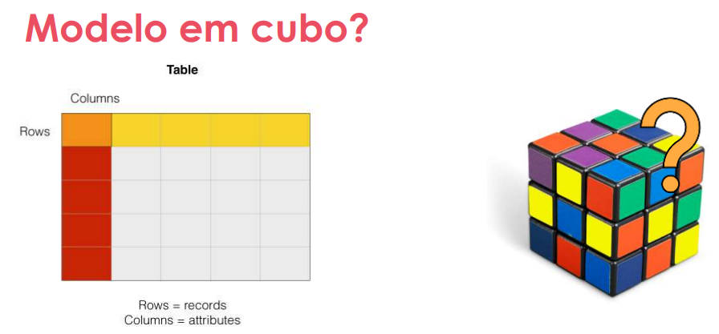
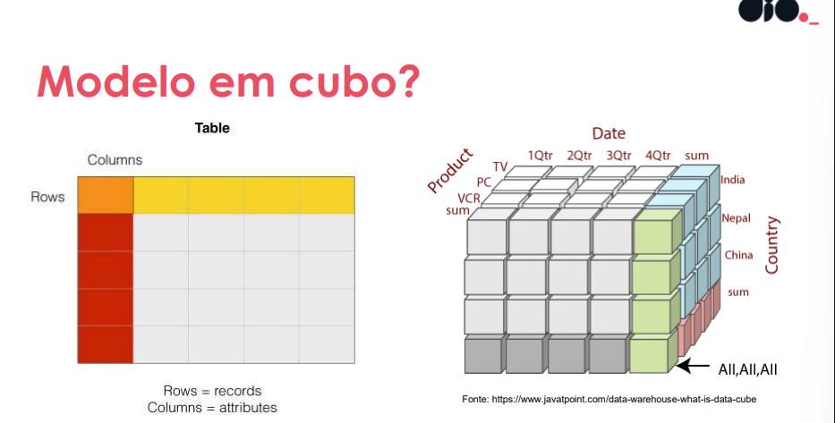
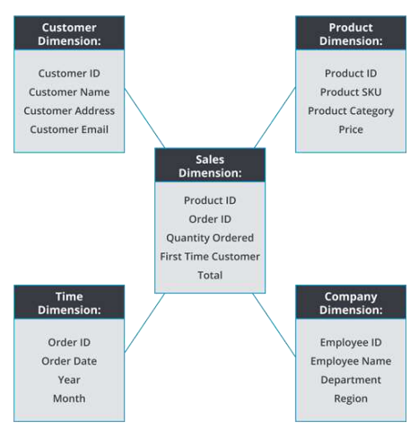
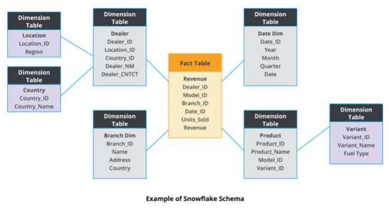
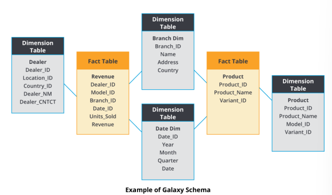

## Introdução a Modelagem Dimensional

> Objetivo Geral
- Entender o que é modelagem dimensional
- O que é Cubo multifacetado?
- Principais modelos dimensionais
- Sistemas Transacionais e Analíticos
- Comparação entre transacional e dimensional
- Criação de esquemas transactional e dimensional

> Modelagem Dimensional
- Modelagem Dimensional é uma técnica de design de banco de dados voltada para a organização eficiente de dados para análise e relatórios.
- O objetivo é facilitar a consulta e a análise de dados, especialmente em ambientes de Business Intelligence e Data Warehousing.
- Motivação: - Performance - Escalabilidade - Disponibilidade

- Sistemas de Dados
- **Modelo transacional – tradicional**: focado em operações de leitura e escrita, otimizado para transações rápidas e integridade dos dados.
- **Modelo dimensional – analítico**: focado em consultas complexas e análises, otimizado para leitura e agregação de dados.

*Transacional*
- Fim específico
- Cenário otimizado
- Suporte a operação
- SGBDs

*Analítico*
- Permite redundâncias
- Esquema flexível
- Foco em analyses
- Modelo em cubo

---

---

> Formalizando o Cubo
Características
- Eixos: representa os componentes do esquema
- Interseção: Representam medidas e dados do contexto
- Visão consolidada do contexto
- Análises de perspectivas distintas

> Qual é melhor?

- *Transacional*
- Sistemas de vendas
- Alta disponibilidade
- Confiança na estrutura
e restrições

- *Analítico*
- Análise x Disponibilidade
- Consolidar informarções
- Análises dos dados

**Coexistem** – cada sistema possui sua particularidade.

> Entendendo Modelagem com Start Schema
- Esquema Estrela (Star Schema): uma estrutura de banco de dados onde uma tabela central (fato) é conectada a várias tabelas dimensionais, formando uma configuração em forma de estrela. A tabela fato contém as medidas quantitativas, enquanto as tabelas dimensionais armazenam os atributos descritivos relacionados às medidas.

- Tabela do meio (tabela fato) vai herdar as informações das tabelas de dimensão, e as tabelas de dimensão não se relacionam entre si, apenas com a tabela fato. O esquema estrela é amplamente utilizado em data warehousing e business intelligence para facilitar consultas analíticas e melhorar o desempenho em grandes volumes de dados.
---

---

> Esquema Floco de Neve (Snowflake Schema)
- Esquema Floco de Neve (Snowflake Schema): uma variação do esquema estrela onde as tabelas dimensionais são normalizadas, ou seja, divididas em sub-tabelas para reduzir a redundância de dados. No esquema floco de neve, as tabelas dimensionais podem se relacionar entre si, formando uma estrutura mais complexa em comparação ao esquema estrela.

---

---

> Esquema Galáxia (Galaxy Schema)
- Esquema Galáxia (Galaxy Schema): uma estrutura de banco de dados onde múltiplas tabelas fato compartilham as mesmas tabelas dimensionais. No esquema galáxia, as tabelas dimensionais são reutilizadas por várias tabelas fato, permitindo uma modelagem mais flexível e eficiente para cenários onde diferentes processos de negócios compartilham dimensões comuns. Essa abordagem é útil para evitar a duplicação de dados e facilitar a manutenção do modelo dimensional em ambientes de business intelligence e data warehousing.

---

---

> Modelo Estrela

- Mais difundido dos modelos
- Star schema
- Conexão das tabelas em forma de estrela
- Dois tipos de tabelas: Fato e Dimensão

- **Tabela Fato** – *Principal*: contém as medidas quantitativas, como vendas, lucros, etc. Ela é o centro do esquema e se conecta a todas as tabelas dimensionais. (Se relaciona com as demais por meio de junções) (Aspectos que compõem o contexto
analisado)

- **Tabelas Dimensão** – *destalhes*: armazenam os atributos descritivos relacionados às medidas, como tempo, localização, produto, cliente, etc. Elas se conectam à tabela fato e não se relacionam entre si. (PKs simples e dados exclusivos) (Detalhes de um aspecto específico)

- **Chave Artificial**: é uma chave primária gerada artificialmente para identificar de forma única cada registro em uma tabela, geralmente utilizando um número sequencial. 

> Modelo Snowflake

- Variação do modelo estrela
- Tabelas dimensão podem ter junções entre si
- Impondo um nível de normalização
- Pode comprometer o desempenho.

> Constelação / Galáxia

- Múltiplas Estrelas são relacionadas entre si
- Tabelas fatos podem compartilhar tabelas dimensão
- Integra diversos assuntos em um mesmo contexto

#### O que é Granularidade de dados?
- Grão ou granularidade
- Nível de detalhamento dos dados na tabela fato
- Maior o grão – menos detalhes
- Trade-off na definição

> Não adianta modelo perfeito sem poder de processamento.

#### Chave Artificial com Start Schema
- Chave relacionada ao modelo dimensional
- Substitui a identificação sem sobreposição
- Facilita a identificação de registros no modelo atual

- O famoso id complexo. Para resolver usando ela.

- Intuito: evitar sobreposição de chaves naturais, garantir unicidade e facilitar a identificação de registros no modelo dimensional.

- A chave especial na modelagem dimensional que substitui a chave primária (PK) natural ou composta é a Surrogate Key (ou Chave Substituta). Ela é um identificador numérico, sequencial e artificial, gerado automaticamente, que não possui significado de negócio e garante alta performance em Data Warehouses.

#### Site:
- **app.sqldbm.com**: ferramenta de modelagem de banco de dados online que permite criar, visualizar e gerenciar esquemas de banco de dados de forma intuitiva. 
- O SQLDBM é amplamente utilizado por desenvolvedores, analistas de dados e arquitetos de banco de dados para projetar e otimizar estruturas de dados em projetos de software e data warehousing.

> Modelo relacional:
- é um modelo de banco de dados que organiza os dados em tabelas (ou relações) compostas por linhas e colunas. Cada tabela representa uma entidade ou conceito, e as colunas representam os atributos dessa entidade. O modelo relacional é baseado na teoria dos conjuntos e utiliza chaves primárias e estrangeiras para estabelecer relacionamentos entre as tabelas, permitindo consultas complexas e a integridade dos dados. 

- Ele é bem estruturado no desenho das tabelas que fazemos atualamente. 

#### Modelo Dimensional – Slowly Changing Dimensions

- Relacionados as mudanças temporais dos dados

Tipo de dimensão
- *SCD-0*.
- **SCD-1, 2**.
- **SCD-3, 4, 5**.
- **SCD-6 [1,2,3]**.

Tipo SCD-0
- Não há modificação
- Modo passive
- TRUNCATE TABLE – sem histórico

Tipo SCD-1
- Atualização dos valores
- Sem rastreamento de mudanças
- UPDATE ou INSERT

Tipo SCD-2
- Preocupação com histórico
- Modos distintos de rastrear as mudanças

Tipo SCD-3
- Novos atributos (colunas) são criados
- Manter o estado de um atributo específico

Tipo SCD-4
- Manutenção do histórico com Tabela de histórico
- Mesma estrutura

Tipo SCD-6
- Junção dos tipor 1, 2 e 3 = 6 (somatório)