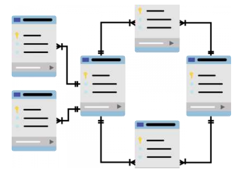

## Modelagem de Dados no Power BI
Objetivo Geral
- Trabalhar com modelagem no Power BI
- Tratar relações (relacionamentos) circulares
- Modelagem dimensional com Power BI
- Trabalhar com tabelas e dimensões
- Apontar alguns desafios da fase de modelagem de dados

---

---

> Vantagens de ter um bom modelo de dados
- A exploração de dados é mais rápida.
- As agregações são mais simples de criar.
- Os relatórios são mais precisos.
- A escrita de relatórios leva menos tempo.
- Os relatórios são mais fáceis de manter no futuro.

Modelo Menor
- Executado mais rápido
- Fácil de entender
- Menor espaço dedicado

**Start Schema**: Mais adequado para o power bi.
• Mais indicada para sistemas analíticos
• Eficiente na recuperação de dados

#### Trabalhando com Tabelas
Vantagens de tabelas simples:
- Navegabilidade de coluna e de tabela amigável para o usuário.
- Ter relações de boa qualidade entre tabelas que fazem sentido.

**Vantagens de tabelas simples:**
- Ter tabelas mescladas ou acrescentadas para simplificar as tabelas em sua estrutura de dados.

> Facilidade de navegação.

> No power bi: deixar o mais enxuto possível, para facilitar a navegação e a construção de relatórios. Deletar as colunas não necessárias.

- Edição dos relacionamentos no power bi: para evitar relacionamentos circulares, é possível editar os relacionamentos e escolher a direção do filtro cruzado. (Unidirecional ou bidirecional). 

- Direções: 
- Unidirecional: o filtro cruzado é aplicado apenas em uma direção, ou seja, os dados de uma tabela filtram os dados de outra tabela, mas não vice-versa. (Recomendada para evitar relacionamentos circulares)
- Bidirecional: o filtro cruzado é aplicado em ambas as direções, ou seja, os dados de uma tabela filtram os dados de outra tabela e vice-versa. (Pode levar a relacionamentos circulares se não for usado com cuidado).

> A modelagem para o star squema:
- Remoção dos relacionamentos atuais.
- construção de novas tabelas no power query (mescla, adição de colunas para chave simulada e etc).
- Tratamento de dados. 
- Estamos contruindo o Fato e as dimenções.
- Aplica as alterações e constroi os relacionamentos.

#### Trabalhando com Dados Orientados a Data - Temporais

> Criando a Tabela Calendário por Medida utilizando Calendar() com Power BI Desktop
A função Calendar() cria automaticamente uma tabela de datas contínua. Ela preenche todos os dias entre duas datas especificadas, sendo útil para análises temporais sem lacunas. Exemplo: `Calendar(DATE(2023,1,1), DATE(2023,12,31))` gera uma tabela com todos os dias do ano de 2023.

**CALENDARAUTO()**
Descrição: A função CALENDARAUTO() cria automaticamente uma tabela de datas contínua baseada no intervalo de datas encontradas nos dados do modelo. Ela identifica a data mínima e máxima e gera todos os dias entre elas, sendo ideal para criar tabelas de calendário sem especificar datas.

Sintaxe: `CALENDARAUTO([fiscal_year_end_month])`

Exemplo: `CALENDARAUTO(12)` gera uma tabela com todos os dias do intervalo de datas do modelo, considerando o ano fiscal terminando em dezembro.

- YEAR, MONTH, WEEKNUM, WEEKDAY(DIA DA SEMANA 1 - 7)

**Tabelas e Legibilidade**
- Tabelas distintas com datas
- Shipdate - Sales
- OrderDate - Orde

**Como resolver?**
- Dados de origem
- DAX
- Power Query

**Trabalho completo (Engenheiro)**
• Identificar feriados da empresa
• Separar o ano civil e fiscal
• Identificar finais de semana

**O que é Hierarquia de Dados?**
Definção: Organização fundada sobre uma ordem de prioridade entre os elementos de um conjunto ou sobre relações de subordinação entre os membros de um grupo, com graus sucessivos de poderes, de situação e de responsabilidades.

> Hierarquia Pai/Filho
- O processo de exibição de vários níveis filho com base em um pai de nível superior é conhecido como nivelar a hierarquia. 

> Obs: Drill down (ou "detalhamento") é uma técnica de análise de dados usada em BI e relatórios interativos para navegar de informações gerais para níveis mais específicos.

#### Definindo a Granularidade de Dados para Datas com Power BI
- A granularidade de dados é o nível de detalhe que é representado nos dados.A granularidade de dados é o nível de detalhe que é representado nos dados.

**Atenção a Granularidade do seu projeto!**
Quanto mais alto a granularidade mais desempenho é exigido. (Impacto no desempenho do relatório no Power BI).

#### Relembrando Conceitos
> Relações (Relacionamentos)

**Relação muitos para um (*:1) ou um para muitos (1: *):**
- Tem muitas instâncias de um valor em uma coluna que estão relacionadas a uma outra
- Descreve a direcionalidade entre as tabelas de fatos e de dimensões.

**Relação muitos para um (*:1) ou um para muitos (1: *):**
**- Esse é o tipo mais comum de direcionalidade e é o padrão do Power BI quando você está criando relações automaticamente
- Esse é o tipo mais comum de direcionalidade e é o padrão do Power BI quando você está criando relações automaticamente

**Relação (1:1):** *COMBINAR AS TABELAS.*
- Descreve uma relação na qual apenas uma instância de um valor é comum entre duas tabelas. 
- Requer valores exclusivos em ambas as tabelas.

**Relação (1:1):**
- Não é recomendável: informações redundantes  Combinar as tabelas é uma prática mais recomendável.
- Não é recomendado; a falta de valores exclusivos gera ambiguidade e os usuários talvez não saibam qual coluna de valores está se referindo a quê.

**Relação (N:M):**
- Descreve uma relação em que muitos valores estão em comum entre duas tabelas.
- Não requer valores exclusivos em nenhuma das duas tabelas em uma relação.

#### Resolvendo desafios de modelagem

> Problemas com Ciclos: Dependências de relação.
- T1-T2-T3-T1.
- Difícil gerenciamento..
- Dificultam o entendimento das relações.

---

---

- DEPENDENCIAS ENTRE TABELAS AQUI, GERÃO PROBLEMAS POR ALTERAÇÕES.

