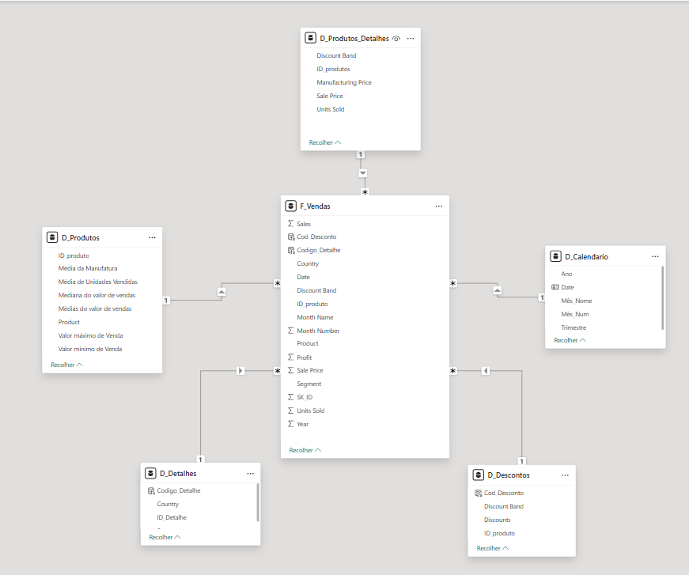

# Desafio de Projeto: Modelagem Dimensional no Power BI com Star Schema

Este repositório contém a resolução do desafio de projeto focado em transformar uma base de dados plana (fret-table) em um modelo **Star Schema** (Esquema em Estrela) para análise de dados financeiros.

## Objetivo do Projeto

O objetivo principal foi desmembrar a tabela única `Financial Sample` em tabelas fato e dimensão, otimizando o modelo para performance e organização, facilitando a criação de relatórios e a aplicação de funções de inteligência de tempo.

##  Etapas do Processo de Construção

### 1. Preparação da Base (Power Query)

* **Criação da Tabela de Backup:** A tabela original foi renomeada para `Financials_origem` e o seu carregamento foi desabilitado para servir apenas como fonte de referência (modo oculto).
* **Tabela D_Produtos:** Utilizei a funcionalidade **"Agrupar por"** (Avançado) para consolidar os dados por produto, calculando métricas como média, mediana, valor máximo e mínimo.
* **Limpeza e Organização:** Para todas as tabelas dimensão, apliquei a remoção de duplicatas para garantir a unicidade das chaves primárias e reorganizei as colunas conforme os requisitos do desafio.

### 2. Criação das Tabelas Dimensão e Fato

* **D_Produtos_Detalhes:** Criada para armazenar informações específicas de descontos e preços de manufatura por produto.
* **D_Descontos:** Agrupamento das informações de faixas de desconto vinculadas aos produtos.
* **D_Detalhes:** Tabela criada para contemplar informações contextuais de vendas que não estavam nas outras dimensões (Segmento e País).
* **F_Vendas:** A tabela fato central que contém as métricas (vendas, lucro, unidades) e as chaves estrangeiras para conexão com as dimensões.

### 3. Modelagem e Funções DAX

Para garantir que o modelo Star Schema funcionasse sem erros de cardinalidade (Muitos-para-Muitos), foram utilizadas funções DAX para criar a tabela de calendário e chaves compostas:

* **D_Calendário:** Criada dinamicamente para permitir análises temporais.
```dax
D_Calendario = 
ADDCOLUMNS(
    CALENDAR(MIN(F_Vendas[Date]), MAX(F_Vendas[Date])),
    "Ano", YEAR([Date]),
    "Mês_Num", MONTH([Date]),
    "Mês_Nome", FORMAT([Date], "MMMM"),
    "Trimestre", "T" & FORMAT([Date], "Q")
)

```


* **Chaves Compostas (Chave_Detalhe e Chave_Desconto):** Utilizadas para criar um identificador único entre tabelas que compartilhavam múltiplos critérios de filtragem, garantindo a relação de **1 para Muitos (1:*)**.
* *Exemplo:* `Chave_Detalhe = F_Vendas[Segment] & "-" & F_Vendas[Country]`


## Diagrama do Esquema em Estrela



---

