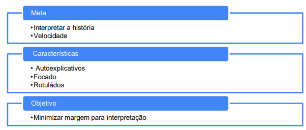
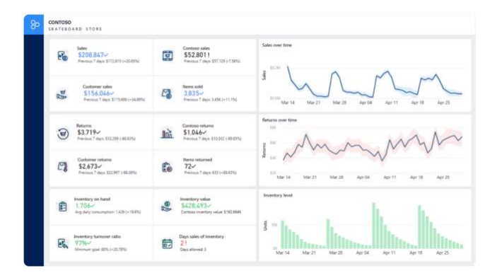
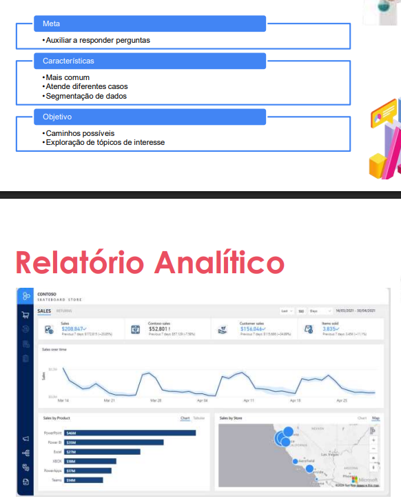
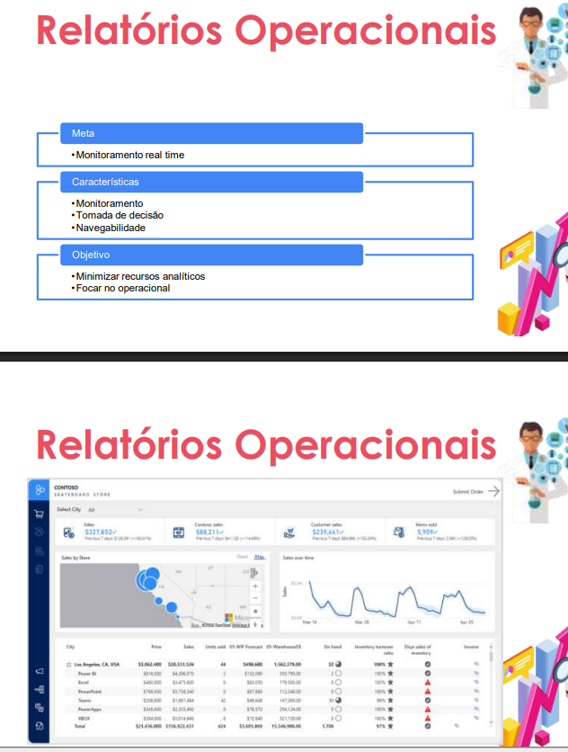
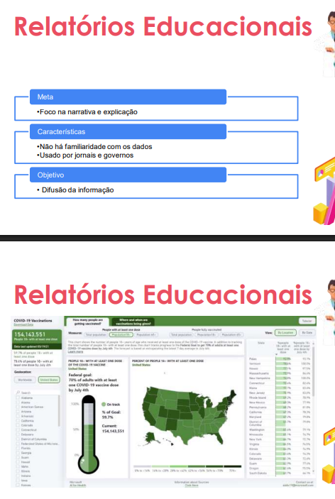
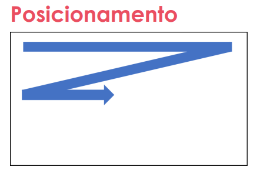
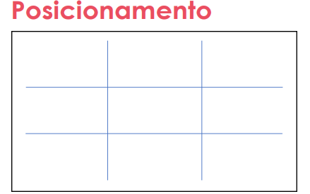
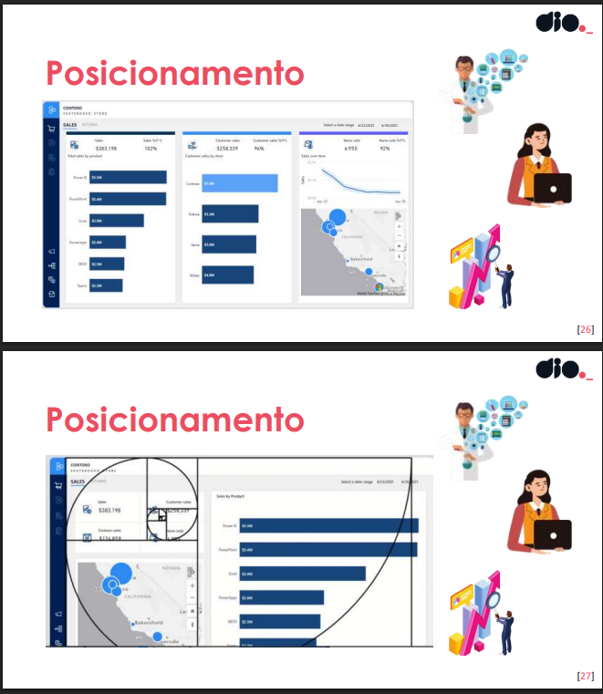
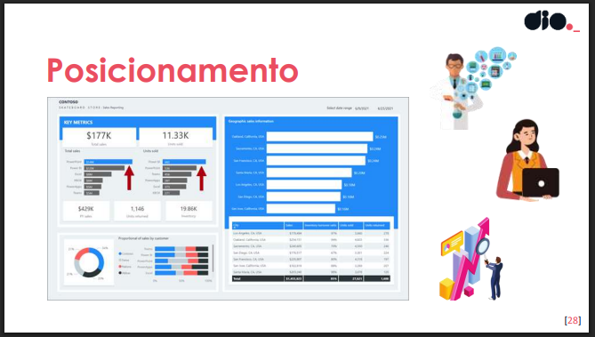

## Criando Relatórios com Foco em Experiência do Usuário
- Um mesmo conjunto de dados sendo apresentado de deiferentes formas.

> Definindo Escopo de Requisito de Design
Meta & Escopo

- Quem quero alcançar?
- Qual tipo de relatório?
- Requisitos de interface
- Experiência do usuário

> Requisitos Necessários

- Exibição padrão de seus dados e lógica de negócios
- Fonte única da verdade Entregar dados atualizados
- Vendas: 24 horas
- Inventário: 1 hora

- Disponibilidade de dados
- Relatórios naturais e amigáveis
- Fornecendo novos insights
- Padrão de marca corporativa

> Público-alvo

- Influencia e impacta no relatório final 

*Perfil de consumidor:*
- Executivo TOMADOR DE DECISÃO.
- Analista METAS E PROCESSOS.
- Operador de informações AUXILIA NA TOMADA DE DECISÃO.

> Reflexão das cores da organização.

#### **Tipos de relatório** 
> **Painel**
---

---

> **Analítico**
---

---

> **Operacional** 
---

---

> **Formação educacional**
---

---
#### Acessibilidade & Requisitos dos Usuários
- Requisitos de UX: **https://learn.microsoft.com/pt-br/training/paths/power-bi-effective/**

> Requisitos do Usuário

No mínimo, o tema deve incluir os seguintes elementos:
- **Marca ou logotipo.**
- **Paleta de cores que se alinhe ou complementam a identidade visual organizacional.**
- **Configurações de texto, incluindo seleção de fonte, tamanhos e cor.**
- Disponibilidade em celular e notebook.

> Acessibilidade

Para dar suporte a pessoas com pouca ou nenhuma visão, considere usar:
- fontes claras e grandes,
- visuais bem espaçados e grandes,
- cores suficientemente contrastantes,
- e navegação de relatório intuitiva que pode ser compreendida por leitores de teclado e tela.

#### Fluxo de exploração em relatórios Analíticos

- Estrutura
Fases:
- *Filtragem* – Alvo de relevância.
- *Agrupamento* – divide os resultados em grupos.
- *Resumo* – Produz resultado de valor único. Matemático.

#### **Estrutura e Boas Práticas**
- *Leitura em Z*
- Posicionamento dos gráficos
- Delimitação de espaço.
- Contraste de cores.
- Repetição de cores = associação. 
- Comforme as cores. 

---

---

### Explorando bons e maus exemplos de gráficos:
- Ratings visual by.

> Quando o conjunto pode crescer muito (ex: produtos, disciplinas, clientes), você precisa evitar gráficos que fiquem poluídos.

Gráficos mais adequados
- Gráfico de barras horizontais

Melhor opção para muitas categorias.
Permite rolagem
Melhor leitura de nomes grandes
Funciona bem com Top N